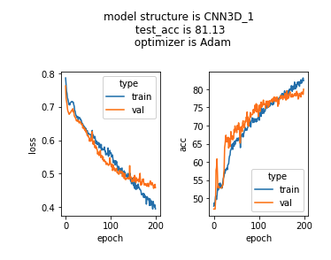

# Latent Brain Structural Features Associated with Abnormal Developmental Trajectory 

## contents 
  * [objective](#objective)
  * [data](#data)
  * [project_step](#project_step)
  * [참고자료](#참고자료)
  * [test_model](#test_model)
  * [결과](#결과)
  
  
## objective  
정신 질환, 그 중에서도 abnormal trajectory에 영향을 미치는 정신 질환과 연관된 Brain의 latent something을 Neural Net이 represent 할 수 있을까?  
뇌-행동을 한번 mapping 해보고자 하는 것.  
Brain에서 질병으로 가는 ‘latent something’을 알 수 있지 않을까?  
이를 multi task learning을 통해서, 서로 heterogeneous한 것으로 보이는 정신질환들에서, ‘abnormal developmental trajectory’를 뇌의 수준에서 표상하는 structural feature를 뽑아낼 수 있을까?

## data 
ABCD release 2.0 T1w data (n_subject = 7088)

## project_step 
  * **step 1**: 다양한 Neural Net architecture (DenseNet, ResNet, vision transformer=optional)로 가장 간단한 변수들(sex, age 등)이 학습이 되는지를 확인해서 **모델 확인**      
  * **step 2**: 목적으로 하는 target variable들로 실험을 해보기. **Multi task learning.** 
  * **step 3**: **interpretation(grad-CAM**) 과정을 통해서 이미지의 어떤 부분에 attention이 있는 지 히트맵으로 확인하거나 **전체 heat map의 distribution을 살펴보면서 insight 끌어 내기**.  예를 들면, ASD를 target으로 예측하고 heat map을 봤는데 다른 cluster가 생기는지 확인. 목적은 Neural Network를 scientific tool로써 사용해보는 것! (아마 Bayesian approach가 해석의 측면에서도 도움이 될 것 같다! 하지만 학습이 오래 걸린다는 단점은 존재)
  * **step 4**: **Transfer learning** 시도 해보기.

## 참고자료
  * [optimizer](https://dacon.io/codeshare/2370): 모델 상관없이 붙일 수 있는 optimizer. model의 generalizability를 증가시키는 방법. 간단한 ResNet에만 붙여도 성능 향상 및 generalizability 증가  
  * [FixRes (Fixing the test-train discrepancy)](https://arxiv.org/pdf/2003.08237v5.pdf): 모델 상관없이 붙일 수 있음. train과 test 시의 input 이미지의 해상도를 바꾸는 기법.  
  * [multi task learning](https://arxiv.org/pdf/2003.08237v5.pdf)
  * [Recent version survey of multi task learning](https://arxiv.org/pdf/2009.09796.pdf) (NDDR-CNN은 확장성이 좋음) 

## test_model
  * **Simple CNN architecture**
  * **VGGNet (11, 13, 16, 19)**
  * **ResNet** 
  * **DenseNet**
  * **EfficientNet**

## 결과 
### STEP 1. Sex Classification
#

  
  
  

   Figure 1. Simple CNN results
#  
  
간단한 CNN의 경우 잘 학습 됨. 적절한 epoch은 100~150. 

### STEP 2. Multitask Learning

### STEP 3. Interpretation 

### STEP 4. Transfer Learning
